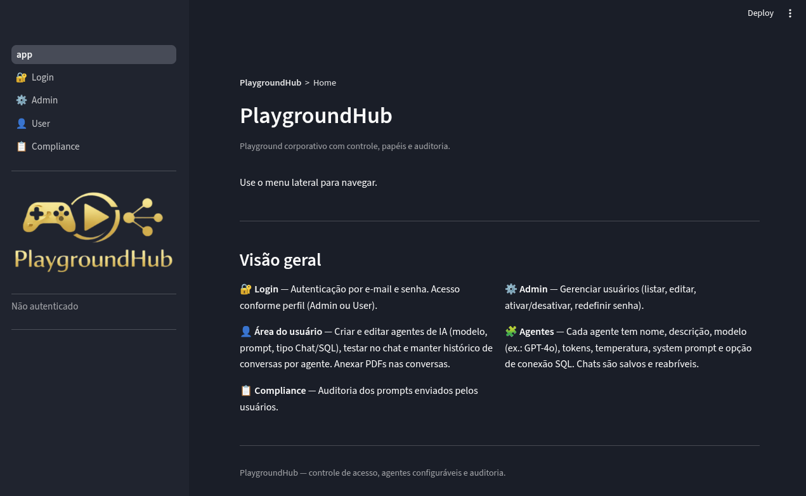
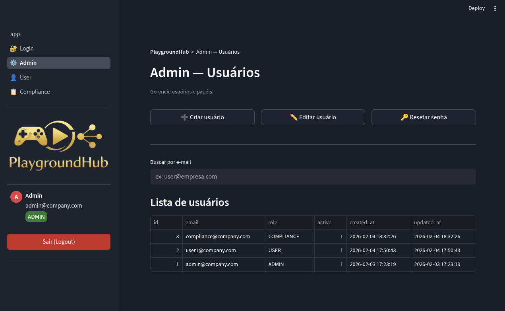
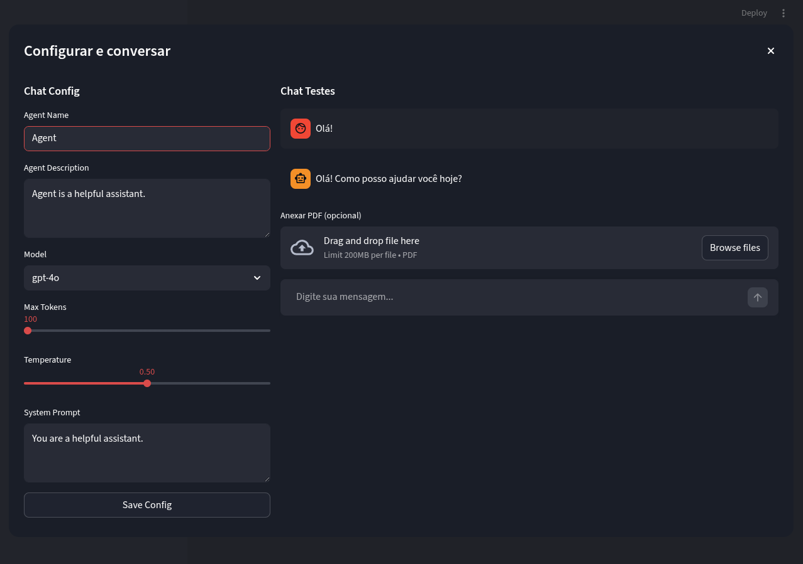
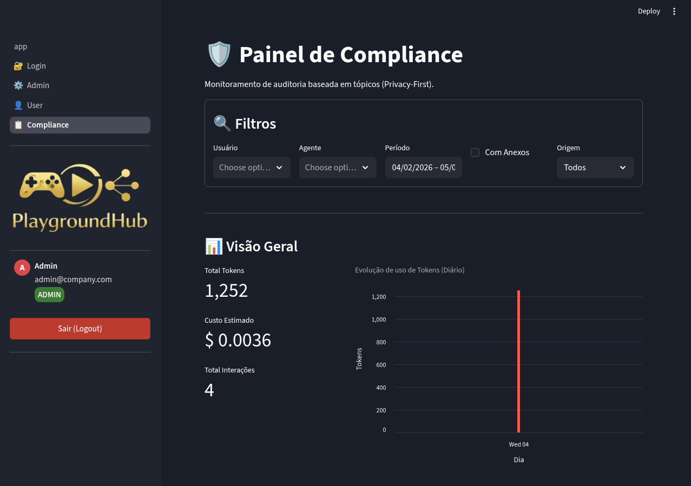

# 🧩 PlaygroundHub

**PlaygroundHub** é uma plataforma corporativa segura e controlada para o uso de Modelos de Linguagem (LLMs), desenvolvida em Python com **Streamlit**.

O objetivo é permitir que colaboradores utilizem o poder da IA (como GPT-4) de forma governada, permitindo a criação de agentes personalizados, mantendo histórico de conversas e oferecendo um módulo de auditoria (Compliance) que respeita a privacidade dos dados.



---

## 🚀 Funcionalidades Principais

### 🔐 Autenticação e RBAC (Controle de Acesso)

* **Sistema de Login:** Autenticação segura via e-mail e senha.
* **Papéis de Usuário (Roles):**
* **ADMIN:** Gerencia usuários, reseta senhas e tem acesso total.
* **USER:** Cria agentes, acessa o chat e gerencia seu histórico.
* **COMPLIANCE:** Acesso exclusivo ao painel de auditoria.


### ⚙️ Gestão de Usuários (Painel Admin)

* Criação de novos usuários com definição de permissões.
* Edição de perfis e ativação/desativação de contas.
* Reset de senha administrativo.



### 🤖 Criação e Gestão de Agentes

* **Playground de Configuração:** O usuário pode criar agentes definindo:
* **Modelo:** (GPT-4o, GPT-3.5-turbo, etc).
* **System Prompt:** A "personalidade" e regras do agente.
* **Parâmetros:** Temperatura (criatividade) e Limite de Tokens.


* **Chat de Testes:** Área para testar o prompt do agente antes de salvar.
* **Gestão:** Listar, editar e excluir agentes personalizados.



### 💬 Chat Corporativo

* **Histórico Persistente:** Chats são salvos no banco de dados e podem ser retomados.
* **Análise de Documentos:** Suporte nativo para upload de **PDFs** dentro da conversa (RAG simplificado).
* **Interface Amigável:** Layout similar ao ChatGPT.

### 🛡️ Módulo de Compliance (Privacy-First)

* **Auditoria de Uso:** Tabela detalhada de quem usou, qual modelo e quando.
* **Monitoramento de Custos:** Estimativa de custo baseada no consumo de tokens.
* **Privacidade:** O painel exibe um **Resumo do Tópico** (gerado por IA) em vez de mostrar o conteúdo bruto da mensagem do usuário, protegendo segredos industriais ou dados sensíveis.
* **Filtros Avançados:** Filtre por usuário, agente, data ou presença de anexos.



---

## 🛠️ Stack Tecnológica

* **Frontend/Backend:** [Streamlit](https://streamlit.io/) (Python).
* **Banco de Dados:** SQLite (Armazenamento local `data/app.db`).
* **IA/LLM:** OpenAI API (`gpt-4o`, `gpt-3.5-turbo`).
* **Manipulação de Dados:** Pandas.

---

## ⚙️ Instalação e Configuração

### 1. Pré-requisitos

* Python 3.10 ou superior.
* Uma chave de API da OpenAI (`OPENAI_API_KEY`).

### 2. Clonar o repositório

```bash
git clone https://github.com/seu-usuario/PlaygroundHub.git
cd PlaygroundHub

```

### 3. Criar ambiente virtual

```bash
# Windows
python -m venv venv
venv\Scripts\activate

# Linux/Mac
python3 -m venv venv
source venv/bin/activate

```

### 4. Instalar dependências

```bash
pip install -r requirements.txt

```

### 5. Configurar variáveis de ambiente

Crie um arquivo `.env` na raiz do projeto e configure as seguintes variáveis:

```env
# Configurações da OpenAI
OPENAI_API_KEY="sk-..."
OPENAI_TEMPERATURE="0.7"
OPENAI_MAX_OUTPUT_TOKENS="2000"

# Credenciais do Admin Inicial (Criado automaticamente na primeira execução)
ADMIN_EMAIL="admin@empresa.com"
ADMIN_PASSWORD="admin@exemplo123"

# Caminho do Banco de Dados SQLite
APP_DB_PATH="data/app.db"

```

### 6. Executar a aplicação

```bash
streamlit run app.py

```

O sistema irá criar automaticamente o banco de dados e o usuário Admin inicial na primeira execução. Acesse em: `http://localhost:8501`, ou vincule seu repositório do GitHub ao Streamlit Cloud para poder acessar e compartilhar o seu projeto de qualquer lugar.

---

## 📂 Estrutura do Projeto

```text
PlaygroundHub/
├── app.py                 # Ponto de entrada (Home/Login Check)
├── pages/                 # Páginas do Streamlit
│   ├── 1_🔐_Login.py
│   ├── 2_⚙️_Admin.py
│   ├── 3_👤_User.py
│   └── 4_📋_Compliance.py
├── src/
│   ├── agents/            # Lógica de interação com LLM e PDFs
│   ├── auth/              # Autenticação e RBAC
│   ├── core/              # Configurações, Conexão DB, UI Helpers
│   └── repos/             # Repositórios (SQL Queries para SQLite)
├── data/                  # Onde o arquivo app.db será salvo
└── requirements.txt       # Dependências do projeto

```

---

## 🛡️ Decisões de Arquitetura

1. **SQLite:** Escolhido pela facilidade de deploy e portabilidade. O arquivo do banco reside localmente, eliminando custos extras de infraestrutura para instâncias pequenas/médias.
2. **Streamlit:** Permite prototipagem rápida e entrega de uma interface funcional full-stack inteiramente em Python.
3. **Privacy-First Compliance:** A decisão de sumarizar os tópicos das conversas para o auditor (ao invés de mostrar o texto cru) visa equilibrar a governança corporativa com a privacidade individual do colaborador.

---

## 🔜 Próximos Passos (Roadmap)

* [ ] Suporte a outros provedores de LLM (Anthropic/Claude, Ollama local).
* [ ] Migração opcional para PostgreSQL (Supabase) para maior escala.
* [ ] Integração com Vector Database para RAG mais robusto.

---

**Desenvolvido por Eduardo Marques, João Vitor, Milena Aires e Ryan Guilherme.**
